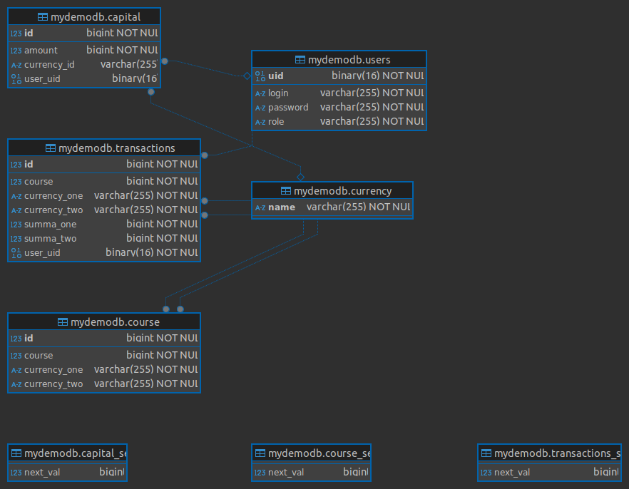

# Серверная часть для задания [Терминал обмена валют](https://github.com/sanai1/TaskOneKFD) (Lab №4)

## Информация
Данный проект является практической работой по программированию, выданной в на курсе **Kotlin FullStack Developer**

## Техническое задание

Разработайте **REST API** для терминала обмена валютных пар. С более подробным ТЗ можно ознакомиться в репозитории Lab №1 (ссылка в заголовке)

### Параметры

- Реализовано REST API (возможны запросы *GET*, *POST*, *PUT*) для работы со всеми сущностями Базы данных
- База данных: **MySQL** (диаграмма представлена в конце раздела с параметрами
- Благодаря реализованному API пользователь может просматривать не только историю по своим транзакциям, но также информацию об актуальном курсе, размере его капитала и информацию о нем самом (логи, пароль (захешированный), привелегии)
- Авторизация реалирована с 2 привелегиями: *USER* и *ADMIN*, все что доступно пользователю, также доступно админо (помимо привелегий на запросы только для админа). Регистрация нового пользователя возможна без всяких привелегий (ограничений на доступ к запросу нет)

 [ссылка на файл JSON](src/test/kotlin/com/example/taskfourkfd/TaskFourKFD.postman_collection.json) для импорта запросов и документации к ним в Postman

### Стэк технологий

- Spring Boot 3
- Spring WEB
- Spring Data JPA
- Spring Security
- MySQL

### Требования

- REST API для всех операций
- Сохранение истории транзакций в БД
- Возможность пользователю посмотреть всои транзакции
- Реализовать авторизацию

## Команда
- [Воронов Александр](https://github.com/sanai1)
